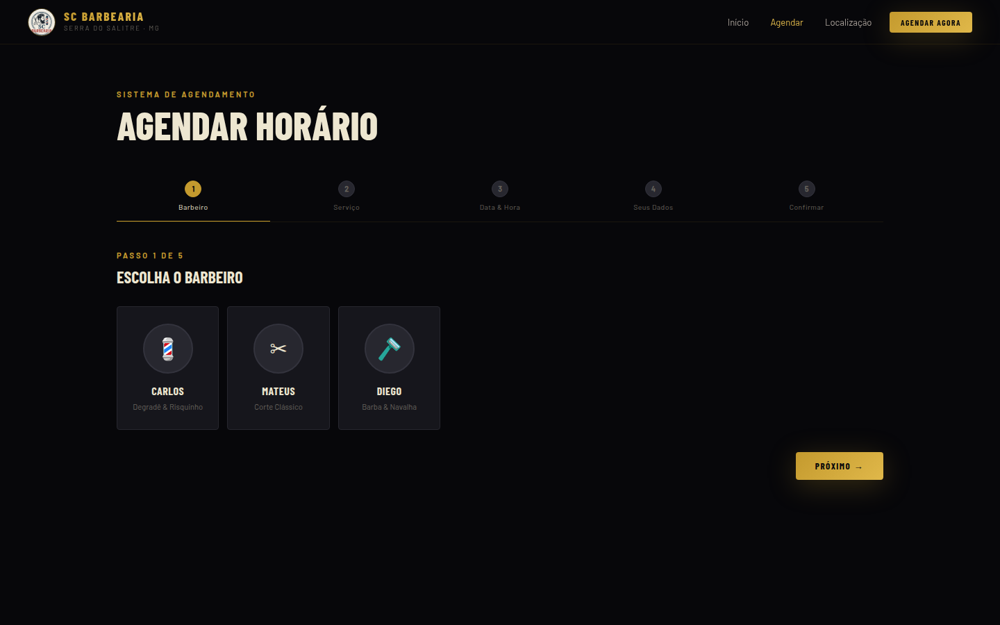
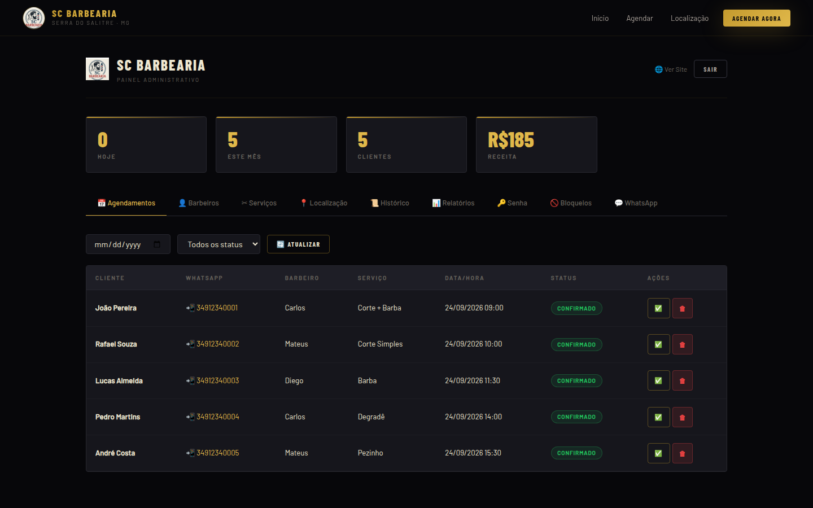

# SC Barbearia — Agendamento Online

[](https://github.com/Mhsilva-dev/sc-barbearia-agendamento/actions/workflows/ci.yml)

Sistema de agendamento online desenvolvido para a **SC Barbearia** (Serra do Salitre, MG) e usado em produção pela barbearia.

O cliente escolhe barbeiro, serviço, data e horário direto pelo celular. Ao finalizar, recebe a confirmação no WhatsApp e, duas horas antes do horário, um lembrete automático. O dono da barbearia gerencia tudo por um painel administrativo: agenda do dia, barbeiros, serviços, horários de funcionamento, bloqueios e relatórios de faturamento.


<p align="center">
  
</p>

## Telas

| Agendamento em etapas | Painel administrativo |
|---|---|
|  |  |

<p align="center">
  
</p>

> Os dados que aparecem nas imagens são fictícios.

## Funcionalidades

**Para o cliente**
- Agendamento em 5 etapas: barbeiro → serviço → data e hora → dados → confirmação
- Só aparecem os horários realmente livres, considerando o expediente de cada dia, os horários já ocupados e os bloqueios
- Confirmação e lembrete automáticos pelo WhatsApp
- Layout responsivo, pensado primeiro para o celular

**Para o administrador**
- Agenda com filtro por data e status (confirmar, concluir, cancelar)
- Cadastro de barbeiros (com foto) e de serviços (preço e duração)
- Horário de funcionamento configurável por dia da semana
- Bloqueio de dias inteiros ou de horários específicos (folgas, feriados)
- Relatórios por período (hoje, semana, mês ou personalizado), com receita, ticket médio e versão para impressão
- Histórico de clientes
- Conexão do WhatsApp pelo próprio painel, via QR Code ou código de pareamento

## Destaques técnicos

- **Fila de envio no WhatsApp.** Todas as mensagens passam por uma fila única, com limite por minuto, intervalo aleatório entre envios e deduplicação, para reduzir o risco de bloqueio do número.
- **Conexão resiliente.** Heartbeat, watchdog e reconexão com backoff exponencial detectam quedas do navegador (Puppeteer) e restabelecem a sessão sem intervenção manual.
- **Lembretes com node-cron.** Um job a cada 15 minutos busca os agendamentos próximos e envia o lembrete uma única vez, controlado por flag no banco.
- **Fuso horário.** Todas as datas e horários são calculados no fuso de Brasília, independentemente do fuso do servidor.
- **Segurança.** Autenticação JWT, senhas com bcrypt, limite de tentativas de login por IP e escape de todo conteúdo dinâmico no front-end contra XSS.
- **Consistência.** Todas as regras são validadas também no servidor: a API recusa com `409` um agendamento em horário ocupado ou bloqueado e rejeita horários fora do expediente.
- **Sem framework no front-end.** SPA em JavaScript puro, dividida em módulos por área (site, agendamento, painel, relatórios).

## Arquitetura

```
Navegador ──► Nginx (SSL) ──► Node.js / Express ──► SQLite
                                   │
                                   ├── node-cron (lembretes)
                                   └── whatsapp-web.js ──► WhatsApp Web
```

A documentação técnica, com diagramas em Mermaid, fica em [`docs/`](docs/):

- [Arquitetura](docs/arquitetura.md)
- [Banco de dados (ERD)](docs/banco-de-dados.md)
- [Fluxo de agendamento](docs/fluxo-agendamento.md)
- [Ciclo de vida do WhatsApp](docs/fluxo-whatsapp.md)
- [Referência da API](docs/api-referencia.md)

## Estrutura

```
backend/
├── config/database.js     schema SQLite e dados iniciais
├── middleware/auth.js     validação do JWT
├── routes/                auth, agendamentos, barbeiros, serviços, bloqueios, config, whatsapp
├── services/
│   ├── whatsapp.js        conexão, fila de envio e mensagens
│   └── scheduler.js       lembretes (cron)
├── utils/datas.js         datas no fuso de Brasília
└── server.js

frontend/public/
├── index.html             SPA (site público + painel)
├── css/main.css
└── js/                    utils, site, agendamento, admin, relatórios, main
```

## Como rodar localmente

Requisitos: Node.js 18 ou superior.

```bash
git clone https://github.com/Mhsilva-dev/sc-barbearia-agendamento.git
cd sc-barbearia-agendamento/backend

npm install
cp .env.example .env     # defina JWT_SECRET e ADMIN_PASS
npm run dev
```

Acesse `http://localhost:3000`. Na primeira execução o banco é criado com barbeiros e serviços de exemplo. O painel administrativo fica em `http://localhost:3000/#painel`.

## Deploy

Em produção, a aplicação roda em uma VPS Linux com **PM2** e **Nginx** como proxy reverso e SSL do **Let's Encrypt**. O repositório inclui um [`nginx.conf`](nginx.conf) de referência e um script de instalação para Ubuntu ([`instalar.sh`](instalar.sh)).

## Autor

Desenvolvido por **Matheus Henrique Fonseca Silva** — [github.com/Mhsilva-dev](https://github.com/Mhsilva-dev)
