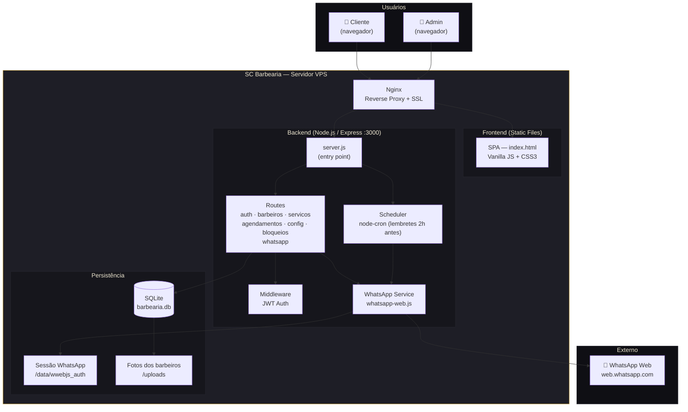

# Arquitetura do Sistema

## Diagrama de Componentes (C4 — Container Level)



---

## Estrutura de Pastas

```
sc-barbearia/
│
├── backend/                    ← API Node.js
│   ├── config/
│   │   └── database.js         ← Inicialização SQLite + schema + seed
│   ├── middleware/
│   │   └── auth.js             ← Verificação JWT
│   ├── routes/
│   │   ├── auth.js             ← Login e troca de senha/usuário
│   │   ├── barbeiros.js        ← CRUD barbeiros + upload de foto
│   │   ├── servicos.js         ← CRUD serviços
│   │   ├── agendamentos.js     ← CRUD agendamentos + relatórios
│   │   ├── config.js           ← Configurações da barbearia
│   │   ├── bloqueios.js        ← Bloqueio de dias e horários
│   │   └── whatsapp.js         ← Status, QR, conectar/desconectar
│   ├── services/
│   │   ├── whatsapp.js         ← Cliente WhatsApp + fila de mensagens
│   │   └── scheduler.js        ← CRON de lembretes automáticos
│   ├── utils/
│   │   └── datas.js            ← Datas/horários no fuso de Brasília
│   ├── data/
│   │   ├── barbearia.db        ← Banco SQLite (não comitar)
│   │   └── wwebjs_auth/        ← Sessão WhatsApp (não comitar)
│   ├── uploads/                ← Fotos dos barbeiros (não comitar)
│   ├── .env                    ← Variáveis de ambiente (não comitar)
│   ├── .env.example            ← Template do .env
│   ├── package.json
│   └── server.js               ← Entry point
│
├── frontend/
│   └── public/
│       ├── css/main.css        ← Design system + componentes
│       ├── js/                 ← Carregados em ordem pelo index.html
│       │   ├── utils.js        ← Estado global, API, formatação, datas
│       │   ├── site.js         ← Navegação, home e localização
│       │   ├── agendamento.js  ← Fluxo de agendamento (5 etapas)
│       │   ├── admin.js        ← Painel: login, agendamentos, cadastros, config
│       │   ├── admin-whatsapp.js ← Painel: conexão do WhatsApp
│       │   ├── relatorios.js   ← Painel: relatórios
│       │   └── main.js         ← Eventos globais e inicialização
│       ├── images/logo.jpg
│       └── index.html          ← Entry point HTML
│
├── docs/                       ← Documentação e diagramas UML
├── .github/workflows/          ← CI/CD (deploy automático)
├── nginx.conf                  ← Config Nginx de referência
├── instalar.sh                 ← Script de instalação
└── README.md
```

---

## Decisões de Arquitetura

| Decisão | Escolha | Motivo |
|---------|---------|--------|
| Banco de dados | SQLite | Volume baixo (~centenas de agendamentos/mês), zero infraestrutura extra, WAL mode para concorrência |
| Frontend | Vanilla JS | Sem dependências de framework, carregamento instantâneo, fácil manutenção |
| WhatsApp | whatsapp-web.js | API oficial paga não disponível no Brasil para MPEs; solução Web é a única viável |
| Auth | JWT (24h) | Stateless, sem sessão no servidor, simples para painel de uso esporádico |
| Scheduler | node-cron (in-process) | Volume de tarefas mínimo, evita dependência de Redis/Bull |
