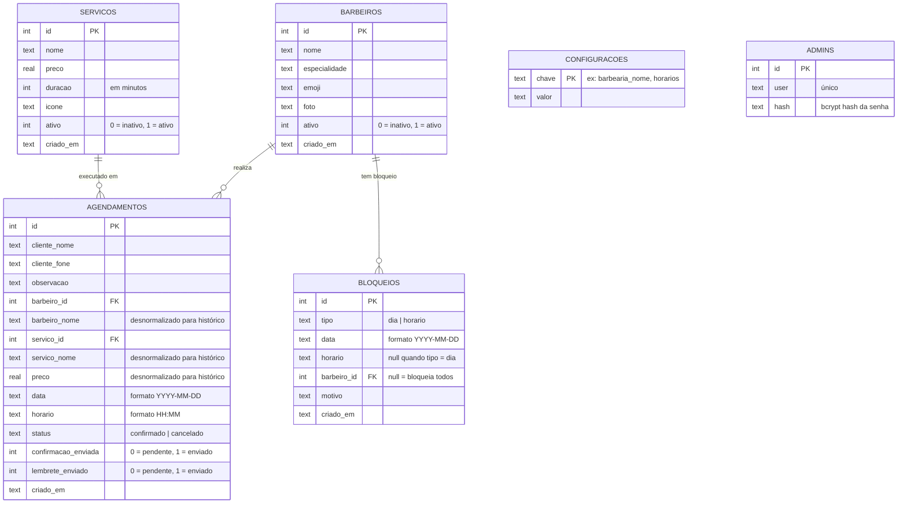

# Banco de Dados — Diagrama ERD

## Diagrama de Entidade e Relacionamento



---

## Índices de Performance

| Índice | Tabela | Colunas | Uso |
|--------|--------|---------|-----|
| `idx_agend_data` | agendamentos | `data` | Consulta de agenda por data |
| `idx_agend_barbeiro` | agendamentos | `barbeiro_id` | Agenda por barbeiro |
| `idx_agend_status` | agendamentos | `status` | Filtragem por status |
| `idx_agend_lembrete` | agendamentos | `lembrete_enviado, status, data` | CRON de lembretes |

---

## Configurações da Chave-Valor (`configuracoes`)

| Chave | Descrição | Exemplo |
|-------|-----------|---------|
| `barbearia_nome` | Nome exibido no site | `SC Barbearia` |
| `endereco` | Endereço completo | `Serra do Salitre, MG` |
| `horarios` | Texto dos horários de atendimento | `Seg–Sex: 08h às 19h` |
| `whatsapp` | Número WhatsApp da barbearia | `5534999999999` |
| `como_chegar` | Descrição de como chegar | `...` |
| `maps_embed` | URL de embed do Google Maps | `https://...` |
| `horarios_funcionamento` | JSON com horários por dia da semana (0=Dom..6=Sáb) | `{"1":{"ini":"08:00","fim":"17:30"},...}` |

---

## Pragmas SQLite Ativos

```sql
PRAGMA journal_mode = WAL;      -- Leituras simultâneas sem bloquear escrita
PRAGMA foreign_keys = ON;       -- Integridade referencial
PRAGMA synchronous  = NORMAL;   -- Equilíbrio entre segurança e performance
```
