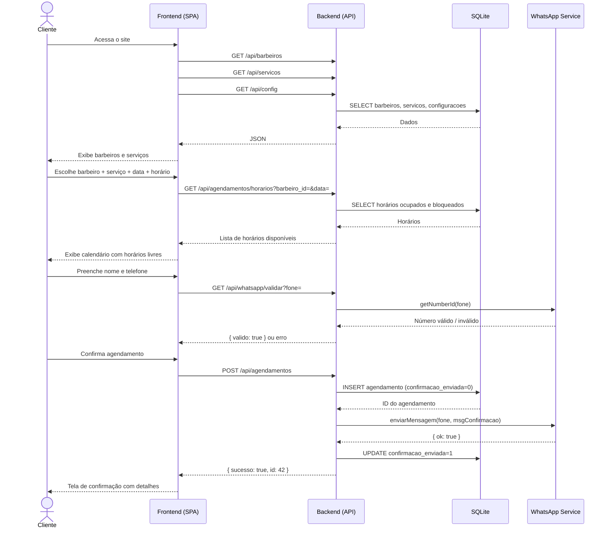
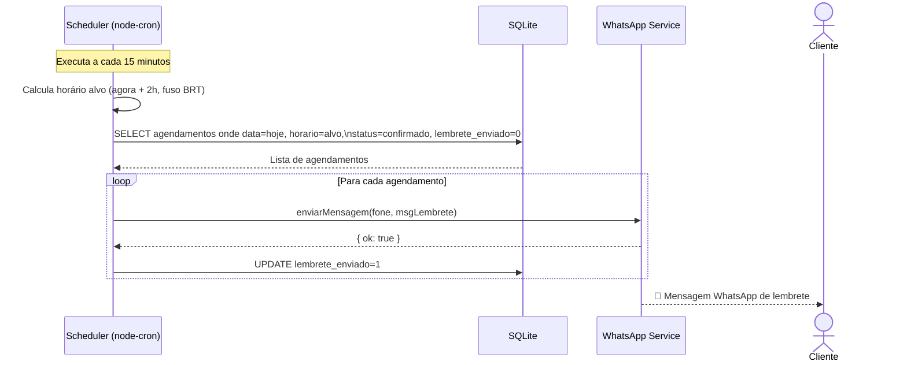
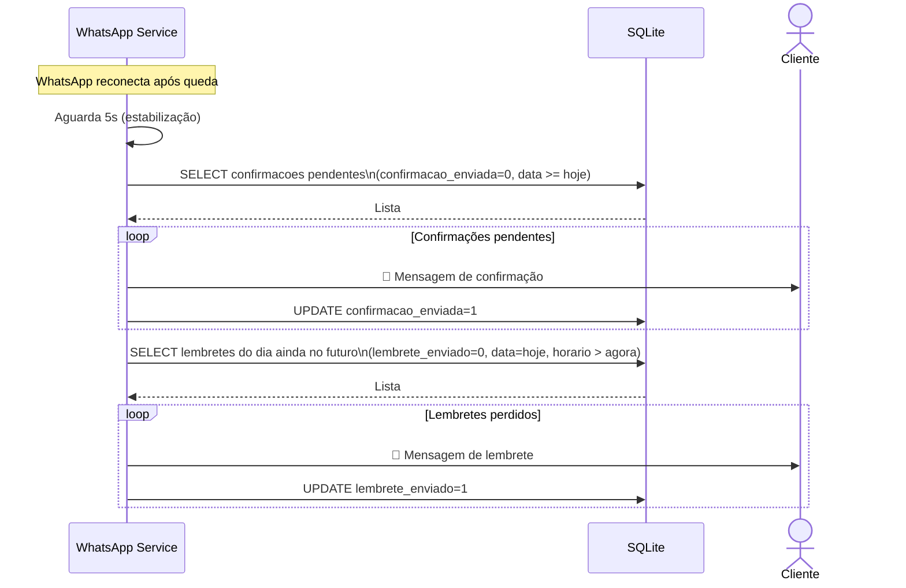
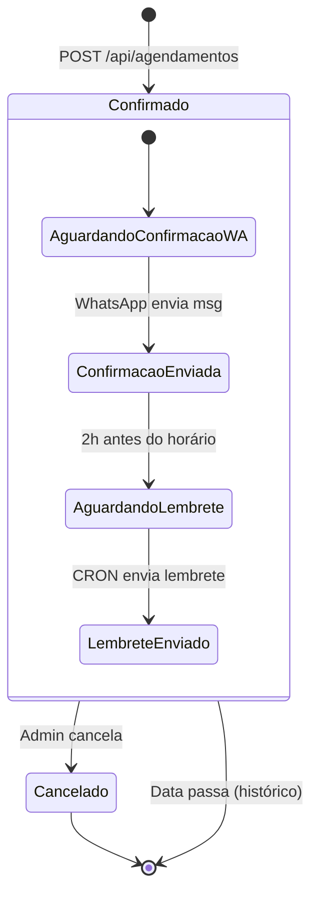

# Fluxo de Agendamento — Jornada do Cliente

## Diagrama de Sequência

```mermaid
sequenceDiagram
  actor Cliente
  participant SPA as Frontend (SPA)
  participant API as Backend (API)
  participant DB  as SQLite
  participant WA  as WhatsApp Service

  Cliente->>SPA: Acessa o site
  SPA->>API: GET /api/barbeiros
  SPA->>API: GET /api/servicos
  SPA->>API: GET /api/config
  API->>DB: SELECT barbeiros, servicos, configuracoes
  DB-->>API: Dados
  API-->>SPA: JSON
  SPA-->>Cliente: Exibe barbeiros e serviços

  Cliente->>SPA: Escolhe barbeiro + serviço + data + horário
  SPA->>API: GET /api/agendamentos/horarios?barbeiro_id=&data=
  API->>DB: SELECT horários ocupados e bloqueados
  DB-->>API: Horários
  API-->>SPA: Lista de horários disponíveis
  SPA-->>Cliente: Exibe calendário com horários livres

  Cliente->>SPA: Preenche nome e telefone
  SPA->>API: GET /api/whatsapp/validar?fone=
  API->>WA: getNumberId(fone)
  WA-->>API: Número válido / inválido
  API-->>SPA: { valido: true } ou erro

  Cliente->>SPA: Confirma agendamento
  SPA->>API: POST /api/agendamentos
  API->>DB: INSERT agendamento (confirmacao_enviada=0)
  DB-->>API: ID do agendamento
  API->>WA: enviarMensagem(fone, msgConfirmacao)
  WA-->>API: { ok: true }
  API->>DB: UPDATE confirmacao_enviada=1
  API-->>SPA: { sucesso: true, id: 42 }
  SPA-->>Cliente: Tela de confirmação com detalhes
```

---

## Fluxo de Lembrete Automático

```mermaid
sequenceDiagram
  participant CRON as Scheduler (node-cron)
  participant DB   as SQLite
  participant WA   as WhatsApp Service
  actor Cliente

  Note over CRON: Executa a cada 15 minutos
  CRON->>CRON: Calcula horário alvo (agora + 2h, fuso BRT)
  CRON->>DB: SELECT agendamentos onde data=hoje, horario=alvo,\nstatus=confirmado, lembrete_enviado=0
  DB-->>CRON: Lista de agendamentos
  loop Para cada agendamento
    CRON->>WA: enviarMensagem(fone, msgLembrete)
    WA-->>CRON: { ok: true }
    CRON->>DB: UPDATE lembrete_enviado=1
  end
  WA-->>Cliente: 📱 Mensagem WhatsApp de lembrete
```

---

## Fluxo de Reenvio após Reconexão

```mermaid
sequenceDiagram
  participant WA   as WhatsApp Service
  participant DB   as SQLite
  actor Cliente

  Note over WA: WhatsApp reconecta após queda
  WA->>WA: Aguarda 5s (estabilização)

  WA->>DB: SELECT confirmacoes pendentes\n(confirmacao_enviada=0, data >= hoje)
  DB-->>WA: Lista
  loop Confirmações pendentes
    WA->>Cliente: 📱 Mensagem de confirmação
    WA->>DB: UPDATE confirmacao_enviada=1
  end

  WA->>DB: SELECT lembretes do dia ainda no futuro\n(lembrete_enviado=0, data=hoje, horario > agora)
  DB-->>WA: Lista
  loop Lembretes perdidos
    WA->>Cliente: 📱 Mensagem de lembrete
    WA->>DB: UPDATE lembrete_enviado=1
  end
```

---

## Estados do Agendamento

```mermaid
stateDiagram-v2
  [*] --> Confirmado : POST /api/agendamentos
  Confirmado --> Cancelado : Admin cancela
  Cancelado --> [*]
  Confirmado --> [*] : Data passa (histórico)

  state Confirmado {
    [*] --> AguardandoConfirmacaoWA
    AguardandoConfirmacaoWA --> ConfirmacaoEnviada : WhatsApp envia msg
    ConfirmacaoEnviada --> AguardandoLembrete : 2h antes do horário
    AguardandoLembrete --> LembreteEnviado : CRON envia lembrete
  }
```
