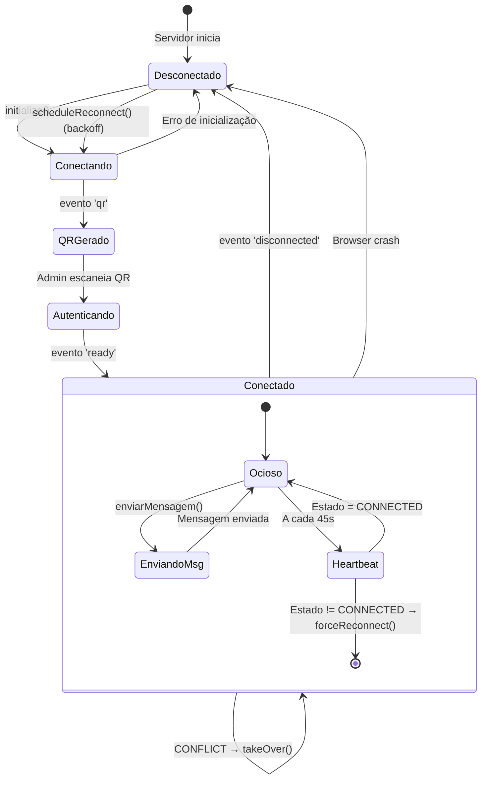
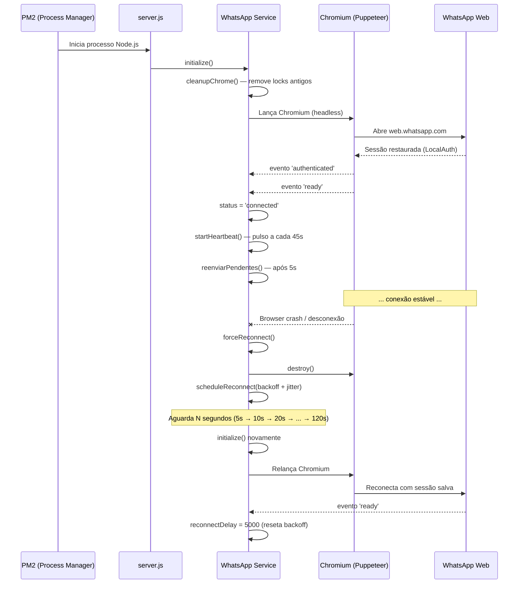
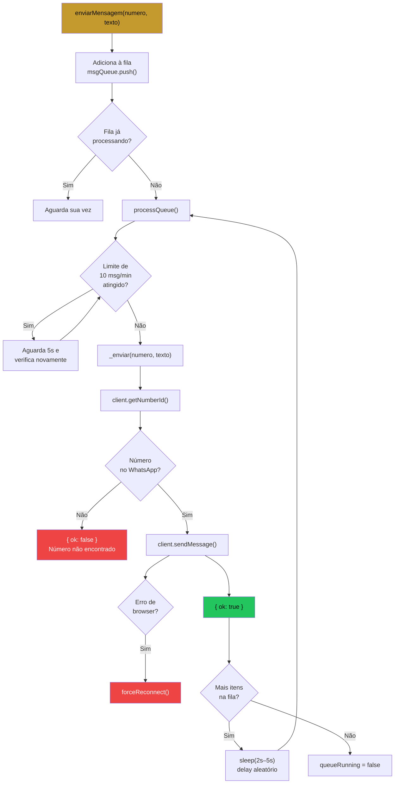

# Fluxo WhatsApp — Ciclo de Vida da Conexão

## Máquina de Estados

---

## Diagrama de Sequência — Conexão e Reconexão

---

## Fila de Mensagens (Anti-ban)

---

## Configurações do Chromium

| Flag | Motivo |
|------|--------|
| `--no-sandbox` | Necessário para rodar como root no Linux |
| `--disable-setuid-sandbox` | Complemento ao no-sandbox |
| `--disable-dev-shm-usage` | Evita crash por `/dev/shm` pequeno em VPS |
| `--disable-gpu` | Sem GPU no servidor |
| `--no-zygote` | Evita processo zygote desnecessário em servidor |
| `--disable-blink-features=AutomationControlled` | Oculta flag de automação do browser |
| `--lang=pt-BR` | Simula usuário brasileiro |
| `--window-size=1280,800` | Resolução realista |

> **Removido:** `--single-process` — causa crashes constantes ao isolar tudo em um único processo sem isolamento entre abas/frames.
